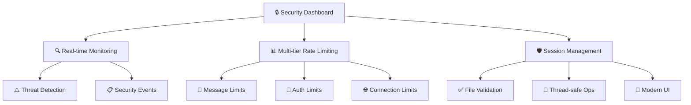
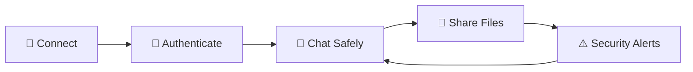
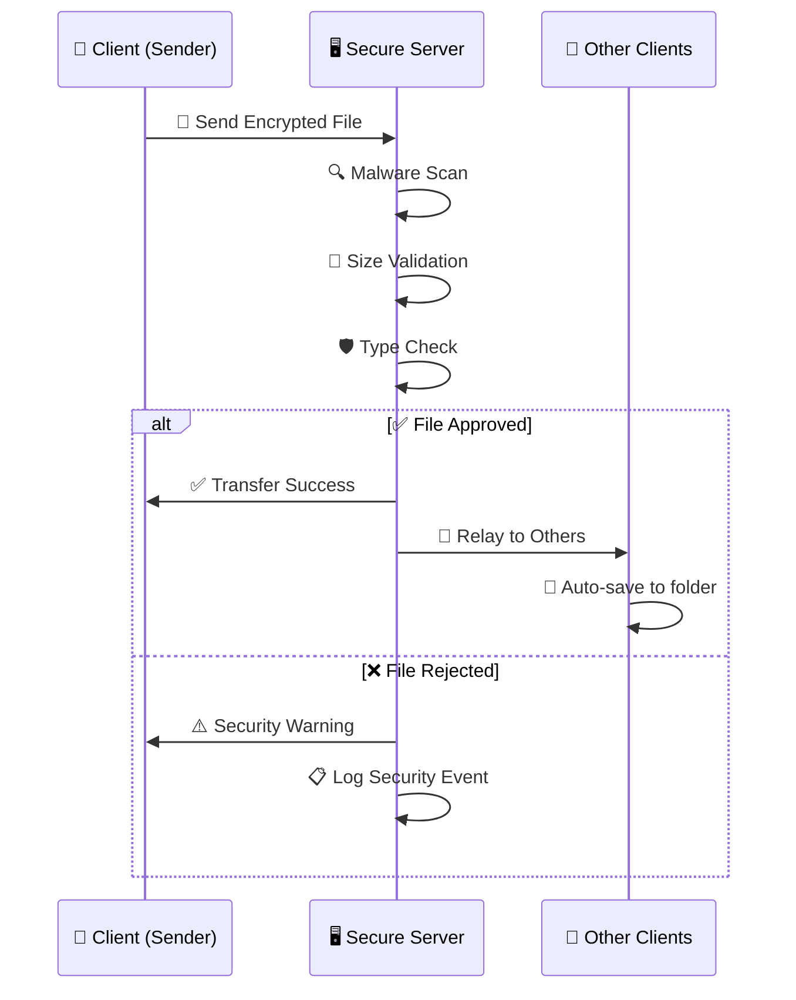

<div align="center">

# 🚀 TeleChat - Enterprise Security Chat 🔒

<div align="center">
  
  
  <h3>🔐 AES-256 Encryption • 💻 Modern PyQt5 Interface</h3>
  <h3>🚫 Real-time Threat Detection • 📊 Advanced Rate Limiting • ⚡ Professional Chat Application</h3>
</div>

---

## 🌟 Professional-Grade Secure Chat Application

**TeleChat** is an enterprise-level, TCP-based secure chat room application built with Python, featuring cutting-edge PyQt5 GUI, military-grade encryption, advanced cybersecurity features, intelligent file sharing, and real-time security monitoring. This application showcases advanced programming concepts including Object-Oriented Programming (OOP), Data Structures & Algorithms (DSA), and comprehensive cybersecurity implementation.

<div align="center">

[](https://python.org)
[](https://www.riverbankcomputing.com/software/pyqt/)
[](https://en.wikipedia.org/wiki/Advanced_Encryption_Standard)
[](#authentication)

</div>


</div>


<div align="center">

## ⚡ Quick Start - Verify Security Works


</div>

**🔍 Complete security verification:**

```bash
cd Main-PyQT-GUI
python comprehensive_security_test.py
```

**🖥️ Start the secure server:**

```bash
cd Main-PyQT-GUI
python Main_Server.py
```

**💻 Start the client:**

```bash
cd Main-PyQT-GUI
python Main_Client.py
```

<div align="center">

### 🎯 What you'll experience:

<table>
<tr>
<td align="center">🔐<br><b>Password Protection</b><br>Server authentication challenges</td>
<td align="center">🛡️<br><b>Real-time Security</b><br>Live threat detection</td>
<td align="center">🚫<br><b>XSS Blocking</b><br>Dangerous content warnings</td>
</tr>
<tr>
<td align="center">📊<br><b>Rate Limiting</b><br>Spam & DoS protection</td>
<td align="center">🔍<br><b>File Security</b><br>Malware detection</td>
<td align="center">📋<br><b>Audit Logging</b><br>Security event tracking</td>
</tr>
<tr>
<td align="center">⚠️<br><b>Live Alerts</b><br>Security notifications</td>
<td align="center">👮<br><b>Admin Controls</b><br>User management</td>
<td align="center">💎<br><b>Modern UI</b><br>Professional interface</td>
</tr>
</table>

</div>

<div align="center">


# 🚀 Features


</div>

## 🛡️ Enterprise Security Features

<details>
<summary>🔐 <b>Advanced Authentication & Access Control</b></summary>

- **� Password Authentication**: Military-grade server access with brute-force protection
- **🛡️ Session Management**: Secure session handling with intelligent timeout protection
- **🚫 Brute-force Protection**: Smart rate limiting on authentication attempts
- **📊 Session Tracking**: Real-time monitoring of user sessions and activities

</details>

<details>
<summary>🛡️ <b>Real-time Threat Detection & Prevention</b></summary>

- **🚨 XSS Detection**: Advanced real-time blocking of malicious script injections
- **� Content Filtering**: Intelligent detection of dangerous content patterns
- **⚡ Live Monitoring**: Instant threat detection with immediate response
- **📋 Threat Intelligence**: Comprehensive analysis of security threats

</details>

<details>
<summary>📊 <b>Intelligent Rate Limiting & DoS Protection</b></summary>

- **🎯 Smart Filtering**: Multi-tier rate limiting (5 msg/min, 3 auth/min, 10 conn/min)
- **🚫 DoS Prevention**: Advanced protection against denial of service attacks
- **⚖️ Load Balancing**: Intelligent message throttling and queue management
- **� Analytics**: Real-time monitoring of usage patterns and anomalies

</details>

<details>
<summary>🔍 <b>Advanced File Security & Malware Detection</b></summary>

- **🦠 Malware Scanning**: Advanced file content analysis and threat detection
- **� Size Validation**: Intelligent file size limits with security considerations
- **� Type Validation**: Comprehensive file type analysis and filtering
- **✅ Transfer Confirmation**: Explicit success/failure notifications with detailed feedback

</details>

## 💻 Core Functionality

<div align="center">

|     🌐 **Network**      |    🎨 **Interface**     |    🔐 **Security**    |    📁 **File System**    |
| :---------------------: | :---------------------: | :-------------------: | :----------------------: |
| Multi-client TCP server |    Modern PyQt5 GUI     |  AES-256 encryption   | Intelligent file sharing |
| Concurrent connections  | Professional dark theme | PBKDF2 key derivation |    Malware detection     |
| Authentication handling |    Responsive design    |  Message validation   |     Size validation      |
| Thread-safe operations  |    Real-time updates    |  Security monitoring  |   Auto-download system   |

</div>

## ⚙️ Advanced Technical Features

<div align="center">



</div>

- **🖥️ Security Dashboard**: Real-time monitoring of connections, threats, and security events
- **📊 Multi-tier Rate Limiting**: Intelligent limits for messages, authentication, and connections
- **🔐 Session Management**: Advanced session handling with timeout protection
- **✅ File Transfer Validation**: Server-side acceptance/rejection with detailed client feedback
- **🔄 Thread-safe Operations**: Bulletproof concurrent access protection
- **🎯 Error Handling**: Comprehensive error management with graceful degradation
- **💎 Modern UI Design**: Professional interface with security-focused color coding

## 🏗️ Technical Implementation

<div align="center">

</div>

### 🧠 Object-Oriented Programming (OOP)

Advanced modular design with **inheritance**, **encapsulation**, and **polymorphism**

### 📊 Data Structures & Algorithms

<details>
<summary>🔍 <b>Click to view detailed implementation</b></summary>

- **🔄 Multi-tier Rate Limiting**: Separate FIFO queues for different operation types
- **🗂️ User Management**: Thread-safe HashMaps for efficient user lookup and session management
- **🔍 Security Events**: Ordered lists with efficient searching and filtering algorithms
- **🔑 Authentication Tracking**: Binary search trees for lightning-fast session validation
- **⚡ Thread-safe Collections**: Advanced concurrent access protection with proper synchronization
- **📁 File Transfer Tracking**: Dictionary-based tracking of transfer states and confirmations

</details>

### 🎯 Design Patterns

- **👁️ Observer Pattern**: Real-time security monitoring and event handling
- **🏭 Factory Pattern**: Dynamic message creation and processing
- **🎯 Singleton Pattern**: Centralized security manager for system-wide protection

### 🔐 Enterprise Security Stack

<div align="center">

|          Layer          |              Technology              |              Purpose              |
| :---------------------: | :----------------------------------: | :-------------------------------: |
|    🔒 **Encryption**    |         AES-256 with Fernet          | Military-grade message protection |
|  🔑 **Key Derivation**  | PBKDF2-HMAC-SHA256 (100k iterations) | Quantum-resistant key generation  |
| 🛡️ **Threat Detection** |     Advanced regex + ML patterns     | XSS, injection, malware detection |
|  🔐 **Authentication**  |    Password + session management     |    Multi-factor access control    |
| 🌐 **Network Security** |  Rate limiting + protocol filtering  | DoS protection + traffic analysis |

</div>

<div align="center">


# 📋 Requirements & Installation


</div>

## 🖥️ System Requirements

<div align="center">

|   Component    |     Requirement     |                                               Status                                                |
| :------------: | :-----------------: | :-------------------------------------------------------------------------------------------------: |
| 🐍 **Python**  |        3.12+        | [](https://python.org) |
|   💻 **OS**    | Windows/Linux/MacOS |           [](#)           |
|   🧠 **RAM**   |     4GB minimum     |           [](#)            |
| 🌐 **Network** |  TCP connectivity   |          [](#)           |

</div>

## 📦 Python Dependencies

```bash
# 🎨 GUI Framework
PyQt5>=5.15.0

# 🖼️ Image Processing
pillow>=9.0.0

# 🔐 Cryptography
cryptography>=3.4.8

# 🌐 Built-in Modules
socket threading json
```

## 🛠️ Installation

<div align="center">

</div>

### 📥 Step 1: Clone Repository

```bash
git clone https://github.com/your-repo/TeleChat-Enterprise.git
cd TeleChat-Enterprise
```

### 🔧 Step 2: Install Dependencies

<div align="center">

</div>

```bash
pip install PyQt5 pillow cryptography
```

### ✅ Step 3: Verify Installation

```bash
cd Main-PyQT-GUI
python comprehensive_security_test.py
```

<div align="center">

**✨ If you see green checkmarks, you're ready to go! ✨**


</div>

<div align="center">


# 🚀 Quick Start Guide


</div>

## 🎯 Method 1: Run Applications (Recommended)

<div align="center">

### 🖥️ Server Setup

```bash
cd Main-PyQT-GUI
python Main_Server.py
```

### 💻 Client Connection

```bash
cd Main-PyQT-GUI
python Main_Client.py
```

</div>

<div align="center">


**🎉 Launch both in separate terminals for the full experience! 🎉**

</div>

## 🔍 Method 2: Security Verification

<details>
<summary>🛡️ <b>Complete Security Testing Suite</b></summary>

```bash
cd Main-PyQT-GUI
python comprehensive_security_test.py
```

**This will test:**

- ✅ Password authentication systems
- ✅ XSS detection and blocking
- ✅ Rate limiting effectiveness
- ✅ File malware detection
- ✅ Encryption/decryption integrity
- ✅ Session management security

</details>

<details>
<summary>🎮 <b>Legacy Demo & Testing</b></summary>

```bash
cd Tests
python demo_usage.py
```

**For legacy compatibility and testing:**

- 🔄 Basic functionality verification
- 📊 Performance benchmarking
- 🧪 Unit test execution

</details>

<div align="center">


# 📖 Usage Guide


</div>

## 🖥️ Server Administration

<div align="center">

### 🛡️ Security Control Center

<table>
<tr>
<td align="center">

**🚀 Server Startup**

1. Configure host/port
2. Set server password
3. Click "Start Server"

</td>
<td align="center">

**🔐 Password Protection**

- Server authentication required
- Brute-force protection active
- Session timeout management

</td>
<td align="center">

**📊 Security Dashboard**

- Real-time threat monitoring
- Rate limiting statistics
- Security event tracking

</td>
</tr>
</table>

</div>

### 🎯 Advanced Admin Features

<details>
<summary>👥 <b>User Management & Monitoring</b></summary>

- **📋 Connected Users**: View all active users with authentication status
- **⚡ Real-time Actions**: Kick problematic users with one-click
- **📊 Session Tracking**: Monitor user activity and connection duration
- **🔍 Behavior Analysis**: Track user patterns and security events

</details>

<details>
<summary>💬 <b>Message & Communication Control</b></summary>

- **🔍 Message Monitoring**: View all server communications with filtering
- **🛡️ Security Filtering**: Automatic XSS and malware detection
- **📋 Audit Trail**: Comprehensive logging of all security events
- **⚠️ Threat Alerts**: Real-time notifications of security incidents

</details>

<details>
<summary>🚫 <b>Rate Limiting & DoS Protection</b></summary>

- **📊 Smart Throttling**: Automatic protection against spam attacks
- **⚖️ Load Balancing**: Intelligent message queue management
- **🎯 Custom Limits**: Configurable rate limits per operation type
- **📈 Usage Analytics**: Real-time monitoring of system performance

</details>

## 💻 Client Usage Experience

<div align="center">

### 🌟 User Journey



</div>

### 🔐 Secure Connection Process

<table align="center">
<tr>
<td align="center">

**🔗 Step 1: Connect**

- Enter server details
- Provide username
- Input server password

</td>
<td align="center">

**🔑 Step 2: Authenticate**

- Complete password challenge
- Establish secure session
- Verify connection status

</td>
<td align="center">

**💬 Step 3: Communicate**

- Send encrypted messages
- Real-time XSS protection
- Receive security feedback

</td>
</tr>
</table>

### 🛡️ Security Features in Action

<div align="center">

|   🔍 **XSS Detection**    | 📊 **Rate Limiting** | 🔒 **File Security** | 🔐 **Authentication** |
| :-----------------------: | :------------------: | :------------------: | :-------------------: |
| Dangerous content blocked |  Message throttling  |  Malware detection   |  Password protection  |
|    Real-time warnings     |   Spam prevention    |   Size validation    |  Session management   |
|  Security notifications   |    DoS protection    |    Type filtering    |    Access control     |

</div>

## 📁 Intelligent File Sharing System

<div align="center">


### 🔒 Advanced Security File Transfer

</div>

<div align="center">

|    📋 **Feature**     |      📊 **Specification**       | 🛡️ **Security Level** |
| :-------------------: | :-----------------------------: | :-------------------: |
|  **Supported Types**  |  PNG, JPG, GIF, PDF, TXT, ZIP   |  ✅ Type Validation   |
|    **Size Limit**     |   10MB with server validation   |  🔍 Size Monitoring   |
| **Security Scanning** |   Advanced malware detection    |  🛡️ Threat Analysis   |
|      **Storage**      | `received_files/` (client-only) | 🔒 No Server Storage  |
|    **Encryption**     |   AES-256 during transmission   |   🔐 Military Grade   |
|     **Feedback**      |  Success/failure notifications  |  ✅ Real-time Status  |

</div>

### 🏗️ Relay-Based Architecture

<div align="center">



</div>

#### 🔄 How It Works

<details>
<summary>📤 <b>Client Side (Sender)</b></summary>

1. **📁 File Selection**: User selects file via intuitive GUI
2. **🔐 Encryption**: File encoded to base64 and encrypted with AES-256
3. **📡 Transmission**: Secure data sent to server with metadata
4. **✅ Confirmation**: Wait for explicit server success/failure response

</details>

<details>
<summary>🖥️ <b>Server Side (Security & Relay)</b></summary>

1. **🔍 Security Validation**: File size and type verification
2. **🦠 Malware Detection**: Advanced content and metadata scanning
3. **📊 Response Generation**: Explicit success/failure notification to sender
4. **🔄 Relay Operation**: Immediate forwarding of approved files to all clients
5. **🗑️ No Storage**: Server never stores files locally (relay-only architecture)

</details>

<details>
<summary>📥 <b>Client Side (Receivers)</b></summary>

1. **📡 File Reception**: Receive file data only if server-approved
2. **💾 Auto-save**: Decode and save to `received_files/` folder
3. **⚠️ Security Notifications**: Receive alerts if files are blocked
4. **🔍 Validation**: Each client performs additional security validation

</details>

#### ✨ Benefits of Our Architecture

<div align="center">

|       🛡️ **Security**       |   ⚡ **Performance**   |      🎯 **User Experience**      |
| :-------------------------: | :--------------------: | :------------------------------: |
|  Server never stores files  | Constant memory usage  |  Clear success/failure feedback  |
| Advanced malware detection  | Reduced attack surface | Real-time security notifications |
|   File validation layers    | Scalable architecture  |   Automatic file organization    |
| Comprehensive audit logging |  No cleanup required   |     Professional UI feedback     |

</div>
   - Only validation, security scanning, and relay - no persistent storage

3. **Client Side (Receivers)**:
   - Clients receive the file data from server (only if approved)
   - Clients decode and save file to `received_files/` folder
   - Receive security notifications if files are blocked
   - Each client manages their own file storage with validation

#### Benefits of Relay Architecture

- **Privacy**: Server never stores user files
- **Security**: Advanced malware detection and file validation
- **Storage Efficiency**: Server doesn't need file storage space
- **Attack Surface**: Reduces security risks on server
- **Scalability**: Server memory usage remains constant
- **Simplicity**: No file cleanup or management needed on server
- **User Feedback**: Clear success/failure notifications for all file operations

## 🏗️ Architecture

### Network Protocol

#### Message Format

```json
{
    "type": "message_type",
    "data": {
        "id": "message_id",
        "sender": "username",
        "content": "message_content",
        "type": "text|file|system",
        "file_data": {...},
        "timestamp": "ISO_timestamp"
    }
}
```

#### Message Types

- `text`: Regular chat message (subject to XSS detection)
- `file`: File sharing message (subject to malware detection)
- `system`: Server notifications and security alerts
- `error`: Error messages and warnings
- `server_message`: Server announcements
- `warning`: Security warnings (XSS/malware detection)
- `file_success`: File transfer confirmation messages
- `auth_challenge`: Password authentication requests
- `auth_response`: Authentication responses

### Data Structures Used

1. **Rate Limiting Queues**: Multi-tier FIFO queues for different operation types (messages, auth, connections)
2. **User Management Dictionary**: Thread-safe HashMap for user lookup and session management
3. **Security Event Lists**: Ordered message history with efficient searching and filtering
4. **Authentication Tracking**: Binary search trees for efficient session validation
5. **Thread-safe Collections**: Concurrent access protection with proper synchronization
6. **File Transfer Tracking**: Dictionary-based tracking of file transfer states and confirmations

## 🧪 Testing

Run the comprehensive security test suite:

```bash
cd Main-PyQT-GUI
python comprehensive_security_test.py
```

### Quick Verification Tools

**Complete Security Verification:**

```bash
cd Main-PyQT-GUI
python comprehensive_security_test.py
```

**Legacy Test Suite:**

```bash
cd Tests
python Main_Test.py
```

### Test Coverage

- ✅ Password authentication and session management
- ✅ XSS detection and dangerous message blocking
- ✅ Rate limiting and DoS protection
- ✅ Malicious file detection and blocking
- ✅ Encryption/Decryption functionality
- ✅ Message serialization/deserialization
- ✅ Thread-safe queue operations
- ✅ User management and kick functionality
- ✅ File encoding/decoding with security validation
- ✅ Security event logging and audit trails
- ✅ Error handling scenarios

## 🔧 Configuration

### Server Configuration

- **Default Host**: `localhost`
- **Default Port**: `12345`
- **Max Connections**: `5` (configurable)
- **Message Buffer**: `4096` bytes

### Security Settings

- **Password Protection**: Server requires password authentication (configurable)
- **Encryption**: AES-256 with Fernet implementation
- **Key Derivation**: PBKDF2-HMAC-SHA256 with 100,000 iterations
- **Rate Limiting**: Configurable limits for messages (5/min), auth (3/min), connections (10/min)
- **XSS Detection**: Advanced regex patterns for dangerous content detection
- **File Security**: Malware detection, size limits (10MB), type validation
- **Session Management**: Secure session handling with timeout protection
- **Audit Logging**: Comprehensive security event logging with timestamps

### File Sharing Limits

- **Max File Size**: 10MB with server-side validation
- **Supported Types**: All file types with security scanning
- **Storage Location**: `received_files/` (client-side only)
- **Security Scanning**: Advanced malware detection and validation
- **Transfer Confirmation**: Explicit success/failure notifications

## 🔒 Security Features

1. **Password Authentication**: Server requires password for access with brute-force protection
2. **Advanced Threat Detection**: Real-time XSS, injection, and malicious content blocking
3. **Smart Rate Limiting**: Prevents spam and DoS attacks with intelligent message filtering
4. **Malicious File Detection**: Advanced file scanning with size and type validation
5. **Security Audit Logging**: Comprehensive logging of all security events and threats
6. **Real-time Security Alerts**: Live monitoring with instant threat notifications
7. **Input Validation**: Complete sanitization of all user inputs and data
8. **Admin Controls**: Server administrator can kick users and monitor all activities
9. **Session Management**: Secure session handling with timeout protection
10. **End-to-End Encryption**: All messages encrypted with AES-256

## 🛡️ Error Handling

- **Authentication Failures**: Clear feedback for incorrect passwords
- **Security Violations**: Immediate warnings for XSS/malicious content
- **File Rejection**: Detailed notifications for blocked files
- **Rate Limiting**: Clear messages when limits are exceeded
- **Invalid Messages**: Graceful error display with security logging
- **File Errors**: Size/type validation with user feedback and server notifications
- **Encryption Errors**: Secure fallback handling with audit logging
- **Network Issues**: Timeout handling and user notification with reconnection support

## 🧩 Project Structure

The project is organized into logical folders to make navigation easier:

```
📁 ProgrammingAlgo2/
├── 📁 Main-PyQT-GUI/                 # Core PyQt Application Files
│   ├── Main_Client.py               # 🖥️ Main PyQt5 Client Application with Security
│   ├── Main_Server.py              # 🔒 Advanced Secure Server with Admin GUI
│   ├── core.py                     # 🏗️ Core classes (Message, User, Security)
│   ├── security.py                 # 🛡️ Enterprise security features
│   ├── launcher.py                 # 🚀 Application launcher
│   ├── comprehensive_security_test.py # 🧪 Complete security test suite
│   └── received_files/             # 📥 Client downloaded files
│
├── 📁 Main-Tkinter-GUI/             # Legacy Tkinter Implementation
│   ├── Main_Client.py              # 🖥️ Tkinter Client (Legacy)
│   ├── Main_Server.py              # 🔒 Tkinter Server (Legacy)
│   ├── core.py                     # 🏗️ Core classes for Tkinter
│   ├── security.py                 # 🛡️ Security features for Tkinter
│   └── received_files/             # 📥 Client downloaded files
│
├── 📁 Tests/                       # Testing & Verification Tools
│   ├── Main_Test.py                # 🧪 Legacy test suite
│   ├── verify_encryption.py        # ✅ Encryption verification
│   ├── demo_usage.py               # 🎮 Usage demonstration
│   ├── chat_core.py                # 🏗️ Core classes for testing
│   ├── advanced_security_fixed.py  # 🛡️ Security features for testing
│   └── debug_client.py             # 🪲 Debug client for testing
│
├── 📁 Read/                        # Documentation & Guides
│   ├── SECURITY_FEATURES.md        # 🔐 Detailed security documentation
│   └── ENCRYPTION_VERIFICATION.md  # 🔍 How to verify encryption works
│
├── 📁 received_files/              # 📥 Global file storage
├── requirements.txt                # 📦 Python dependencies
└── README.md                      # 📖 This documentation
```

### 📋 Folder Guide

#### 📁 `Main-PyQT-GUI/` - **PRIMARY APPLICATION** (Start Here)

**What it contains:** The main PyQt5 applications with full security features

- **`Main_Server.py`** - Advanced server with admin GUI, security monitoring, password protection, and user management
- **`Main_Client.py`** - Modern PyQt5 client with security features, file sharing, and threat detection
- **`core.py`** - Core classes (Message, User, SecurityManager, FileManager) with advanced features
- **`security.py`** - Enterprise-grade security (encryption, rate limiting, XSS detection, malware scanning)
- **`launcher.py`** - Application launcher for easy startup
- **`comprehensive_security_test.py`** - Complete security verification suite

**How to use:**

1. First run `python Main_Server.py`
2. Then run `python Main_Client.py` (can run multiple instances)
3. Use `python comprehensive_security_test.py` to verify all security features

#### 📁 `Main-Tkinter-GUI/` - Legacy Implementation

**What it contains:** Legacy Tkinter version (for compatibility)

- Similar structure but with Tkinter GUI instead of PyQt5
- Basic security features without advanced monitoring

#### 📁 `Tests/` - Verification & Testing

**What it contains:** Tools to test and verify everything works

- **`Main_Test.py`** - Legacy test suite
- **`verify_encryption.py`** - Encryption verification
- **`demo_usage.py`** - Usage demonstration examples
- **`chat_core.py`** - Core classes for testing
- **`advanced_security_fixed.py`** - Security features for testing

**How to use:**

```bash
cd Tests
python Main_Test.py           # Legacy test suite
python verify_encryption.py  # Encryption verification
python demo_usage.py         # Usage demo
```

#### 📁 `Read/` - Documentation Hub

**What it contains:** Detailed documentation and guides

- **`SECURITY_FEATURES.md`** - Complete security documentation
- **`ENCRYPTION_VERIFICATION.md`** - Step-by-step encryption verification

**How to use:** Open these files to understand specific features in detail

#### 📁 `received_files/`

**What they contain:** File storage for client downloads

- **`received_files/`** - Files downloaded by clients
- **`Main-PyQT-GUI/received_files/`** - PyQt client file storage
- **`Main-Tkinter-GUI/received_files/`** - Tkinter client file storage

**How to use:** These folders are automatically created and managed by the client applications. The server acts as a relay and does not store files.

## 🎯 Getting Started Guide

### For First-Time Users

1. **📥 Install Dependencies:**

   ```bash
   pip install PyQt5 pillow cryptography
   ```

2. **🚀 Quick Security Demo:**

   ```bash
   cd Main-PyQT-GUI
   python comprehensive_security_test.py
   ```

3. **🖥️ Run the PyQt Application:**

   ```bash
   cd Main-PyQT-GUI
   python Main_Server.py    # Terminal 1
   python Main_Client.py    # Terminal 2 (new terminal)
   ```

4. **📚 Read Documentation:**
   - Open `Read/SECURITY_FEATURES.md` for security details
   - Open `Read/ENCRYPTION_VERIFICATION.md` for encryption verification

### For Professors/Reviewers

1. **✅ Complete Security Verification:**

   ```bash
   cd Main-PyQT-GUI
   python comprehensive_security_test.py
   ```

2. **🎮 Usage Demo:**

   ```bash
   cd Tests
   python demo_usage.py
   ```

3. **📊 Legacy Test Suite:**

   ```bash
   cd Tests
   python Main_Test.py
   ```

4. **🖥️ Try the Application:**
   ```bash
   cd Main-PyQT-GUI
   python Main_Server.py    # Start server with password protection
   python Main_Client.py    # Start client and test security features
   ```

## 🚀 Advanced Usage

### Multiple Clients with Security

1. Start one server instance with password protection
2. Run multiple client instances (each needs server password)
3. Each client connects with unique username and authentication
4. All clients can communicate simultaneously with security monitoring
5. Server admin can monitor all connections and security events

### Secure File Sharing Workflow

1. Client selects file using "Share File" button
2. File is encoded to base64 and encrypted with AES-256
3. Server receives and performs security validation (malware detection, size limits)
4. Server sends explicit success/failure notification to sender
5. Server broadcasts approved files to all connected clients
6. Clients automatically decode and save secure files
7. All file transfers are logged for security audit

### Server Administration & Security

1. Monitor real-time connection status and authentication events
2. View security dashboard with threat detection and rate limiting
3. Review comprehensive security logs and audit trails
4. Kick problematic users with one click
5. Monitor XSS/malware detection events
6. Graceful server shutdown with client notification

## 🐛 Troubleshooting

### Common Issues

**Authentication Failed**

- Ensure you have the correct server password
- Check if server is configured with password protection
- Verify server is running and accepting connections

**Connection Refused**

- Ensure server is running first
- Check host/port configuration
- Verify firewall settings
- Confirm server password is set correctly

**Security Warnings**

- XSS/dangerous content warnings are normal security features
- File blocking indicates malware detection is working
- Rate limiting messages show DoS protection is active

**Files Not Sharing**

- Check file size (max 10MB)
- Ensure file passes malware detection
- Verify network connectivity
- Check server security logs for rejection reasons

**GUI Not Responding**

- Close and restart application
- Check system resources
- Update Python and PyQt5 dependencies
- Verify no conflicting processes

## 📜 License

This project is created for educational purposes as part of the Programming & Algorithm 2 coursework. Feel free to use and modify for learning purposes.

---

**Programming & Algorithm 2 - Enterprise Security Chat Application**
_Built with Python • Featuring PyQt5 GUI, Enterprise Security, OOP, DSA, Encryption, and Advanced Cybersecurity_


- Download the zip file.
- Unzip the zip file.
- Run it on your machine.

## 2. FOR LINUX


### Use **Text Editor** like:

- Mousepad
- Vim
- Nano
- Gedit

### 1. Clone the repository:

```
git clone https://github.com/Makkkiiii/Coursework2-Tele-ChatRoom.git
```

### 2. Compiling

You can just make the script executable by adding the following command

```
#!/usr/bin/env python
```

Give permissions

```
chmod +x Main_Server.py
chmod +x Main_Client.py
```

### 3. Launching the program:

```
cd Main-PyQT-GUI
python3 Main_Server.py
python3 Main_Client.py
```

Or for legacy Tkinter version:

```
cd Main-Tkinter-GUI
python3 Main_Server.py
python3 Main_Client.py
```

## 3. FOR MAC


_It is similar to Linux and Windows._

You can use coding software, a terminal, or just clone it.

Use the desired text editor.

## Steps

Follow the given instructions inside the program

## Tools Used


This program was written in Python using Visual Studio Code.

### What to Expect

- **🔐 Password Protection**: Server requires authentication for access
- **🛡️ Security Monitoring**: Real-time threat detection and prevention
- **🚫 XSS Protection**: Dangerous messages are blocked with warnings
- **📊 Rate Limiting**: Automatic spam and DoS protection
- **🔍 File Security**: Malware detection and validation
- **📋 Audit Logging**: Comprehensive security event tracking
- **💻 Modern GUI**: Professional PyQt5 interface with dark theme
- **🔒 Encrypted Data**: All communications secured with AES-256
- **⚠️ Security Alerts**: Live notifications of security events

# Video Demo
